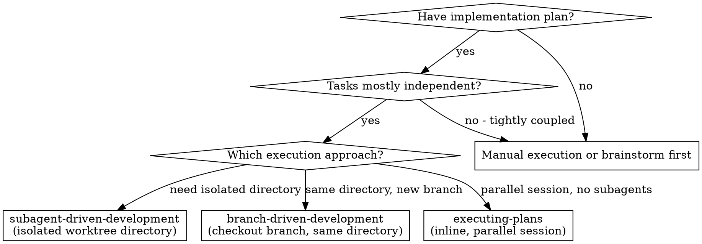
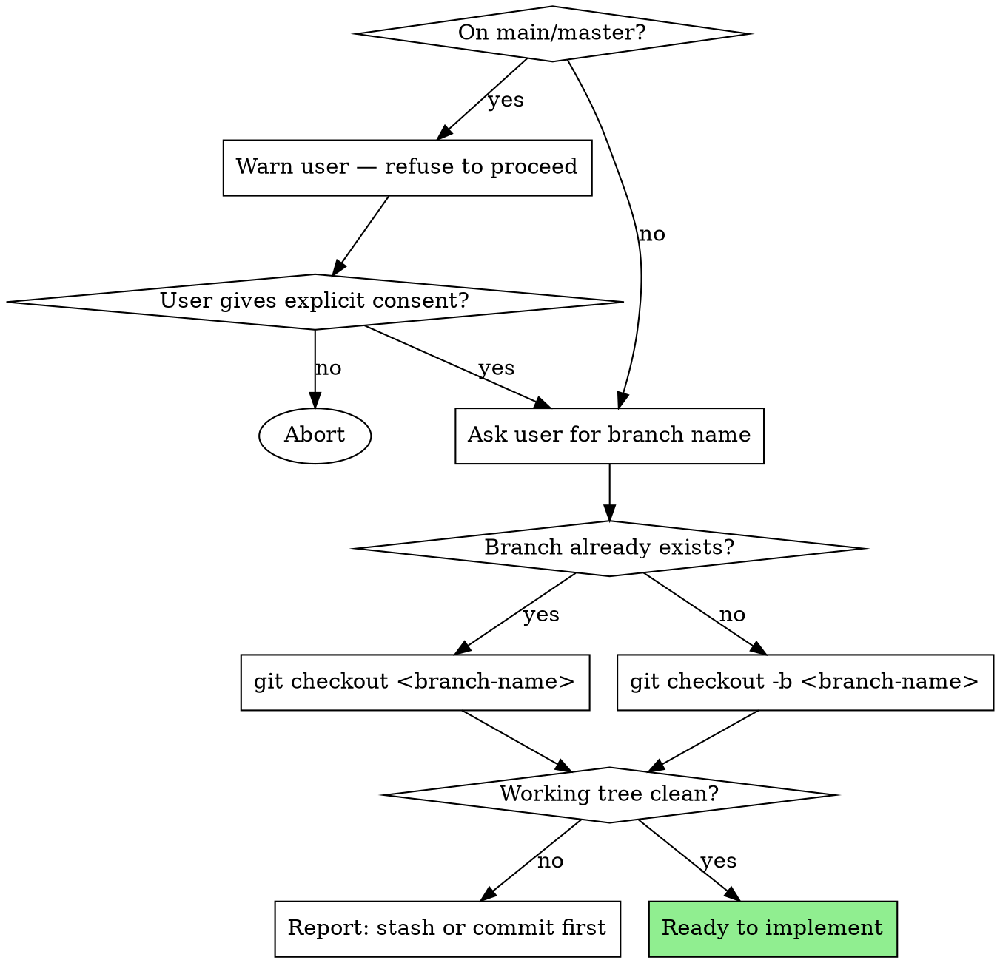
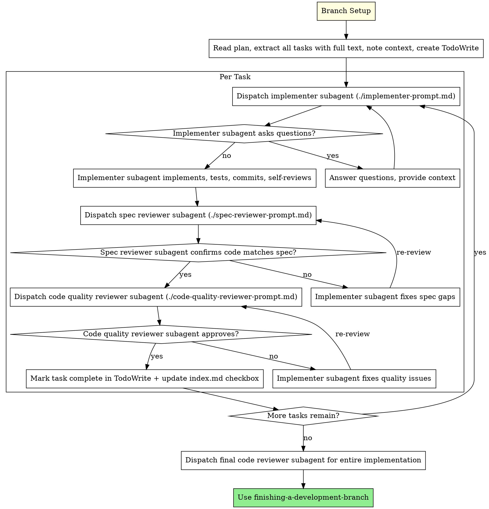

# Branch-Driven Development

Execute plan by checking out a branch in the current directory, then dispatching fresh subagent per task, with two-stage review after each: spec compliance review first, then code quality review.

**Why this over worktrees:** When you want the subagent dispatch + review quality gates of `subagent-driven-development` but don't need a fully isolated directory. Same session, same working tree, new branch.

**Core principle:** Checkout branch → fresh subagent per task + two-stage review (spec then quality) = high quality, fast iteration

## When to Use



**vs. subagent-driven-development:**

- No worktree creation — checkout branch directly in current working tree
- Same session, same directory
- Identical subagent dispatch loop (implementer → spec reviewer → code quality reviewer)
- Useful when worktree setup is unnecessary overhead

**vs. executing-plans (parallel session):**

- Same session (no context switch)
- Fresh subagent per task (no context pollution)
- Two-stage review after each task: spec compliance first, then code quality
- Faster iteration (no human-in-loop between tasks)

## Branch Setup

Before executing any tasks, set up the working branch:



**Rules:**

- Never auto-derive the branch name from the plan or task description — always ask
- `git status --short` must be empty before starting tasks

## The Process



## Model Selection

Use the least powerful model that can handle each role to conserve cost and increase speed.

**Mechanical implementation tasks** (isolated functions, clear specs, 1-2 files): use a fast, cheap model. Most implementation tasks are mechanical when the plan is well-specified.

**Integration and judgment tasks** (multi-file coordination, pattern matching, debugging): use a standard model.

**Architecture, design, and review tasks**: use the most capable available model.

**Task complexity signals:**

- Touches 1-2 files with a complete spec → cheap model
- Touches multiple files with integration concerns → standard model
- Requires design judgment or broad codebase understanding → most capable model

## Handling Implementer Status

Implementer subagents report one of four statuses. Handle each appropriately:

**DONE:** Proceed to spec compliance review.

**DONE_WITH_CONCERNS:** The implementer completed the work but flagged doubts. Read the concerns before proceeding. If the concerns are about correctness or scope, address them before review. If they're observations (e.g., "this file is getting large"), note them and proceed to review.

**NEEDS_CONTEXT:** The implementer needs information that wasn't provided. Provide the missing context and re-dispatch.

**BLOCKED:** The implementer cannot complete the task. Assess the blocker:

1. If it's a context problem, provide more context and re-dispatch with the same model
2. If the task requires more reasoning, re-dispatch with a more capable model
3. If the task is too large, break it into smaller pieces
4. If the plan itself is wrong, escalate to the human

**Never** ignore an escalation or force the same model to retry without changes. If the implementer said it's stuck, something needs to change.

## Prompt Templates

- `./implementer-prompt.md` - Dispatch implementer subagent
- `./spec-reviewer-prompt.md` - Dispatch spec compliance reviewer subagent
- `./code-quality-reviewer-prompt.md` - Dispatch code quality reviewer subagent

## Example Workflow

```
You: I'm using Branch-Driven Development to execute this plan.

[Ask user: "Branch name?" → user provides 'feature/auth']
[Check git status - on 'develop', not main]
[git checkout -b feature/auth]
[git status --short - clean]

[Read plan file once: docs/superpowers/plans/feature-plan.md]
[Extract all 5 tasks with full text and context]
[Create TodoWrite with all tasks]

Task 1: Hook installation script

[Dispatch implementation subagent with full task text + context]

Implementer: "Before I begin - should the hook be installed at user or system level?"

You: "User level (~/.config/superpowers/hooks/)"

Implementer: [implements, commits]
  - Status: DONE

[Dispatch spec compliance reviewer]
Spec reviewer: ✅ Spec compliant

[Dispatch code quality reviewer]
Code reviewer: ✅ Approved

[Mark Task 1 complete]
...
[After all tasks: dispatch final code-reviewer]
[Use finishing-a-development-branch]
Done!
```

## Red Flags

**Never:**

- Start implementation on main/master branch without explicit user consent
- Skip branch setup (checkout or create branch first)
- Skip reviews (spec compliance OR code quality)
- Proceed with unfixed issues
- Dispatch multiple implementation subagents in parallel (conflicts)
- Make subagent read plan file (provide full text instead)
- Skip scene-setting context (subagent needs to understand where task fits)
- Ignore subagent questions (answer before letting them proceed)
- Accept "close enough" on spec compliance (spec reviewer found issues = not done)
- Skip review loops (reviewer found issues = implementer fixes = review again)
- Let implementer self-review replace actual review (both are needed)
- **Start code quality review before spec compliance is ✅** (wrong order)
- Move to next task while either review has open issues
- Auto-derive branch name (always ask the user)

**If subagent asks questions:**

- Answer clearly and completely
- Provide additional context if needed
- Don't rush them into implementation

**If reviewer finds issues:**

- Implementer (same subagent) fixes them
- Reviewer reviews again
- Repeat until approved
- Don't skip the re-review

**If subagent fails task:**

- Dispatch fix subagent with specific instructions
- Don't try to fix manually (context pollution)

## Integration

**Required workflow skills:**

- **writing-plans** - Creates the plan this skill executes
- **requesting-code-review** - Code review template for reviewer subagents
- **finishing-a-development-branch** - Complete development after all tasks

**Subagents should use:**

- **test-driven-development** - Subagents follow TDD for each task

**Alternative workflow:**

- **subagent-driven-development** - Use when isolated worktree directory is needed
- **executing-plans** - Use for parallel session instead of same-session execution
